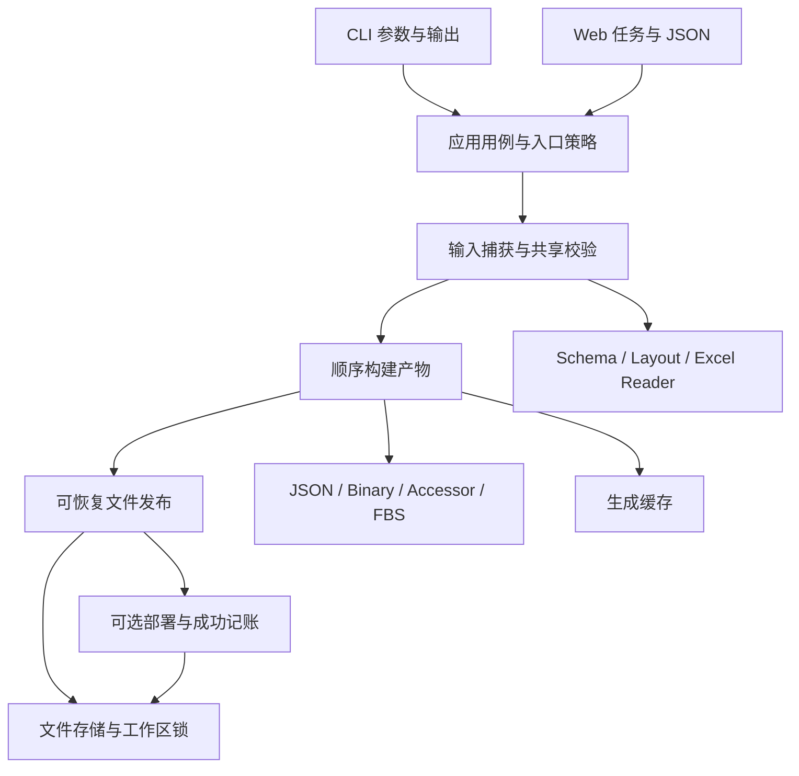

## Context

动机见 [proposal.md](proposal.md)。用户已确认保持 CLI、Schema 与导出格式兼容。本设计以 2026-09-13 的提交 `95f04ad`（增量导出：内容寻址生成缓存 + 传递闭包 schema_hash）为基线：`cache/artifacts.py` 与增量测试已随该提交落地，修订时工作树无本地改动；这些属于基线工作，不算本 change 的实现成果。

本轮只读核验：基线 HEAD 为 `95f04ad`（修订前该文档曾误记为 `66f0123` + 未提交工作树）；使用项目 venv 执行 `python -m pytest ct/tests/architecture/test_architecture.py ct/tests/app/test_incremental_export.py -q`，27 passed。架构测试通过不构成依赖边界有效的证据，原因见下表；未在提案阶段执行完整平台/浏览器/消费者验收，也未修改实现代码。

### 现有架构判断

ct 适合继续作为模块化单体。`schema` 维护资源/类型/图，`excel/layout` 提供稳定物理列映射，生成器消费 canonical 数据；Schema 编辑有独立事务用例，Flutter launcher 负责进程启动。问题集中在应用编排和副作用边界，而非领域模型缺失。

| 代码证据 | 当前事实 | 设计后果 |
|---|---|---|
| `ct/src/ct/app/canonical_export.py::run_canonical_export` | 约 350 行主体同时维护 prepared、layout_info、table_bytes、expected 等并行状态；阶段 2 已写 JSON，阶段 4 才校验 FBS | 构建阶段不再直接覆盖正式输出 |
| `canonical_commands.py::canonical_validate` 与 export 阶段 1 | 重复布局、Excel 读取、主键集合、CodeName/ref 校验；export 导入另一用例模块的私有函数 | 共享 preparation/validation 服务，入口保留诊断包装差异 |
| `canonical_export.py::emit` 与 `cache/artifacts.py::atomic_write` | 单文件 replace 原子，多文件发布不构成事务；manifest 另行写入 | 事务覆盖本次输出、删除与 layout manifest |
| `cli.py::export` 与 `web/tasks.py::CanonicalExportTask._run` | CLI export→deploy→persist，Web export→persist；模块各自决定完成 | 应用服务持有完成策略，适配器只呈现 |
| export 尾部 Excel hash | 在生成完成后重读源文件计算账本，可能与实际解析的版本不同 | hash 从输入快照取值，禁止对稍后的源文件记账 |
| `export/deploy.py` 导入 `ct.app.events` | 存在低层反向依赖 | 事件原语移至无应用依赖的 contracts，旧入口重导出 |
| `tests/architecture/test_architecture.py` | SRC 已是 src/ct，扫描却追加 ct/schema；config.py 单文件不能 rglob；环检测节点无 ct 前缀，边有 ct 前缀 | 修复检查本身，必须有非空断言和故意违规的负例 |
| `app/schema_workspace/apply.py` | 已有 Apply 专用 journal/lock，但锁是 exists 后 write，协议与 export 范围不同 | 不复制这套锁，不宣称两个事务已统一 |

规范也存在漂移：incremental-export 和 cli-interface 仍描述全量重写，当前实现已有缓存；unity-deploy 的“无变化时仍可部署”仍写未实现。本 change 用 delta 明确目标契约，主规范在实现验收后的同步阶段再更新。data-validation 的缓存主键场景、过滤 ref 范围等历史差异留给后续专门处理，不能据此扩大此次行为范围。

## Goals / Non-Goals

**Goals:**

- 单个输入版本贯穿解析、生成与账本；校验逻辑只有一个实现，缓存不绕过校验。
- 用少量明确的数据对象和顺序函数表达管道依赖；任何正式写入都有可定位的 owner。
- 生成失败不改正式输出；文件发布失败可恢复；CLI/Web 保留各自成功策略。
- 通过真实依赖扫描、输出对照和故障注入证明边界，而非依靠文件长度指标。

**Non-Goals:**

- 不引入通用服务容器、运行时插件注册、任务 DAG 引擎、远程缓存或并行生成。
- 不做整个 `canonical_commands.py` 的机械拆分；本轮只抽取校验共用部分和必要完成边界，i18n/模板其余用例继续原位。
- 不承诺电源故障下的全文件系统事务，不承诺未遵守锁的外部程序原子读取，也不改变 Unity 同步算法。

## Decisions

### 1. 保留领域与生成器，收紧应用层

建议模块边界（路径为实现目标，不是已经存在）：

| 模块 | 负责 | 不负责 |
|---|---|---|
| `ct/contracts.py` | ProgressReporter、CancelToken、CancelledError、NullReporter | 应用编排、磁盘与 UI |
| `ct/app/data_preparation.py` | 选中表读取、布局、issues、主键集合；validate/export 共用 | 翻译合并、产物写出 |
| `ct/app/exporting/models.py` | ExportRequest、PreparedExport、TableBuild、ArtifactSet、ExportResult | I/O 与 Flask/Typer |
| `ct/app/exporting/prepare.py` | 配置/资源/Excel/译文输入快照，调用共享校验 | 生成与发布 |
| `ct/app/exporting/build.py` | 原五阶段顺序下的纯生成器调用、缓存及 layout 决策 | 正式目录写入、部署 |
| `ct/app/exporting/service.py` | 锁、恢复、prepare/build/publish、部署策略及成功记账 | 文本/HTTP 呈现 |
| `ct/storage/publication.py` | staged payload、journal、备份、replace、删除、恢复 | 理解 Table/语言/Unity |
| `ct/storage/workspace_lock.py` | 同一规范化 root 的进程间 export/deploy 排他 | Schema 编辑业务 |
| 原 canonical 入口 | 参数与旧返回/异常形状的兼容委托 | 第二套算法 |

`schema`、`excel`、`export`、`cache`、`storage` 禁止依赖 app/web/cli；contracts 无 ct 导入。`app/events.py` 暂时重导出，避免已有内部调用方断裂。cache 的单文件原子写复用 storage 工具，但缓存与发布协议不互相依赖。Schema Apply 保留既有入口与 journal。

替代方案：整体搬成 domain/application/infrastructure 三大目录会制造大规模无行为收益的 diff；仅把大函数拆成小函数仍保留隐式状态和散落发布。选择按本次数据流建立小模块。

### 2. 输入快照与类型对象是阶段间唯一通道

`ExportRequest` 保存 root、table/lang filter、forced；`CompletionPolicy` 只有 export_only 和 export_then_deploy 两种，后者另带 for_build。兼容函数 `run_canonical_export` 仍只导出并返回原 dict，不暗中部署或提交成功账本；CLI/Web 改用完整应用用例。服务内部直接复用同一 pipeline，不递归获取锁。

`PreparedExport` 包含选中表及语言的稳定序列、已解析行/Excel 原始行号、layouts、records/enums、译文快照与 InputRevision。`TableBuild` 把主表/i18n bytes、uniform 决策、slot offsets 放在一起，避免多个字典以表名隐式关联。`ArtifactSet` 保存完整 expected 集合及每个目标的 payload/staged 引用；`ExportResult` 统一 written/reused、缓存计数、hash 和耗时，兼容适配器再序列化成当前字段。

InputRevision 记录规范化文件路径、存在性与 SHA-256，并包含 schemas/types 目录成员列表以检测新增/删除。输入范围包括实际消费的 global.yaml、所有加载的 schema/types、选中 Excel、消费的译文及旧 manifest。源 Excel 字节只捕获一次；reader 由 bytes/只读临时副本读取，错误位置仍指向原 Excel。配置、资源与译文同样从捕获内容解析。快照内部数据有明确所有权，生成器不得修改 canonical 行；不声称 frozen dataclass 自动冻结嵌套 dict。

捕获前后检查源 revision，变化即友好失败；正式发布前再检查。所有正式产物来自同一份已捕获数据，账本使用该快照的 Excel hash。外部 Excel 编辑不遵守锁，最后检查之后发生的修改不会被账本错误记为已导出；不承诺阻止外部写入或跨文件瞬时一致捕获。validate 复用读取/校验内核但不用持久 staging，不创建 cache 文件。

替代方案：整张表解析结果持久缓存会引入主键集合失效问题，本轮不做；每阶段重读工作区会放大混合版本风险。

### 3. 固定顺序构建，不引入通用 DAG

内部仍按数据依赖执行：prepare/validate → JSON 与表 bytes、uniform probe → accessor/manifest payload → FBS 与结构检查 → bundles。保留五个对外步骤名称和顺序；发布作为 Bundle 阶段完成前的内部工作。`step_finished` 只表示阶段退出，最终成功在完成用例返回后确定。

共享 types/enums 继续消费当前全工作区资源集合；表级缓存只消费实际传递的具名依赖。不能为了“统一拓扑序”调整当前序列化顺序、Enum 顺序或 Bundle 成员顺序。uniform 参数由 bytes probe 决定，显式传递到 binary/accessor/manifest。

保留当前 `ArtifactCache.call` 的版本+有效输入内容寻址模型，不再并列接一套 fingerprint 调度。`cache/state.json` 只做成功账本；cache/artifacts 可在失败后保留。缓存 key 因内部模型变化需要失效时升级版本，不能伪称格式不变就无需处理缓存兼容。

替代方案：独立 ExportPlan/DAG 会复制当前五阶段已经表达的依赖，增加调度与缓存解释成本；顺序 pipeline 已足以测试和观察。

### 4. 可恢复发布，精确定义原子性的范围

正式发布覆盖本次 output 文件、导出产生的 layout manifests 和全量导出应删除的陈旧文件。若保留缺失模板生成分支，其新增工作簿也必须纳入同一发布集合；不得在 build 阶段直接写源目录。成功账本、可丢弃缓存和 Unity 目标均不属于此事务。

只有所有生成器与 FBS/uniform 检查通过才开始 publish。生成可先写私有 staging；ArtifactSet 收齐并校验所有目标后生成 journal。目标新内容在目标所在文件系统的临时目录准备，确保最终 replace 不跨卷；cache_dir、output_dir、excel_dir 允许不同卷。

journal 固定在项目根 `.ct/export-publication.json`，锁为 `.ct/export.lock`，不随 cache_dir 修改而失联；发布恢复先于当前配置加载。journal 使用版本 `export-publication/1`、operation id、规范化 root、目标绝对路径白名单、原文件存在性、旧/新 hash、备份和暂存路径、操作类型、阶段。写 journal 用临时文件+replace，恢复前校验路径属于该操作记录的允许目录。原文件 metadata 用 copy2 保存，回滚恢复内容及 mtime。旧 journal 中的目标以当时记录为准，不能按新配置重新推断。私有 `.ct/` 在工具文档中注明且加入工作区忽略建议。

状态机：

1. `prepared`：所有新内容已暂存，完整目标清单已写 journal，正式文件未动。
2. `backed_up`：每个原文件备份完成且 hash 验证通过，原来不存在的文件有明确标记。**备份未全部完成不能写正式目标。**
3. `publishing`：逐文件替换/删除；journal 先声明本次可能触及的完整集合，因此 replace 后记录进度前崩溃仍可回滚。
4. `committed`：全部正式操作完成，原子记录 committed；随后清理备份/staging/journal。

prepared 阶段异常只清理私有资源；backed_up/publishing 异常恢复所有旧文件，并删除本来不存在的新目标；恢复失败保留 journal/备份并拒绝进一步 export/deploy。committed 恢复只完成清理，不能回滚完整新版本。恢复必须幂等，不能照搬 Apply 当前只恢复“有备份文件”的逻辑。只读用例（validate/status）不参与恢复写入，但必须检测并报告未完成或损坏的发布记录，避免校验通过的同时 export 被拒。

内容相同且非 forced 的文件只加入 expected/reused，不进入替换清单，以保留 mtime；forced 全部选中产物进入替换清单。全量旧产物清理也是事务中的删除项；过滤导出禁止清理范围外产物。发布清单在枚举陈旧文件之前排除本次私有临时目录，避免把自身 staging 当旧产物。缓存 prune 在本地发布完成后进行，仅全量执行，不把可丢弃缓存写入 journal。

替代方案：逐文件 atomic_write 无法回滚后段失败；整个 output 目录切换会破坏未变文件 mtime，且无法同时覆盖另一个目录里的 manifests。采用带恢复协议的多文件发布，不称其为外部读者可见的瞬时原子替换。

### 5. 锁、取消与完成边界

同一规范化项目 root 的 export（包括低层兼容入口）、CLI deploy 和 Web export 使用同一进程间排他锁，从恢复/捕获开始直到完成策略和账本处理结束。锁文件固定在 root 下的 ct 私有位置，不依赖可修改的 cache_dir；使用系统 advisory lock（POSIX flock / Windows 文件区间锁）和进程内互斥，不使用 exists→write。进程死亡自动释放；文件存在不等于锁被占用。冲突立即返回可呈现的 busy 错误，不静默排队。不同 root 可以并行。

本轮锁只协调 export/deploy；Schema Apply、模板、i18n 编辑及外部编辑通过输入复核检测，不宣称已建立整个工作区写锁。不同工作区若配置相同物理输出或部署目标，不在此排他保证内，作为明确限制记录。

取消只在准备/构建及进入 publish 之前响应；publish 开始后暂缓取消直到事务完成。不能在完整产物已经提交后把任务误报为 cancelled。崩溃恢复不自动再次部署、不推进账本；下一次显式 export/deploy 在持锁后先恢复本地发布，部署读取完整本地版本。

完整应用用例的完成流程：本地 publish → 输出兼容的“导出完成”通知 → CLI 策略下 deploy → 原子更新成功账本 → 返回成功。Web 策略省略 deploy；独立 deploy 不改成功账本。CLI 的中间通知只表达本地导出完成，部署失败仍非零退出。通知由显式 presenter callback/事件承接，业务层不调用 typer.echo。

部署失败：保留完整本地产物与旧账本，Unity 目标可能部分同步，允许再次部署。这延续现有行为。账本失败同样不能报告整体成功；不回滚已经成功部署的外部目录。完整服务在提交前合并账本最新值以尽量保留其他用例字段；本轮不为所有既有账本写入者提供跨进程串行保证。

### 6. 兼容矩阵与明确延期事项

| 项目 | 本次必须保留 |
|---|---|
| CLI/Web | flags、返回 JSON 形状、中文诊断、五阶段名称；CLI 部署/Web 不部署 |
| 产物 | JSON 文件名实际为 `output/json/{Table}_{lang}.json`；FBS/Binary/Accessor 字节与 API 不变 |
| 过滤 | 单表精确匹配；局部 Bundle；共享类型/枚举照旧；次语言过滤仍写主语言 JSON |
| i18n | confirmed/text 合并规则、稀疏 i18n 表同序等长；export 不 sync |
| 缓存 | warm/forced 字节等价、warm mtime 稳定、损坏缓存重建、成功账本旧格式继续可读 |
| 只读命令 | validate/status 不执行恢复写入，不产生持久文件；但须报告未完成或损坏的发布记录，不静默放行 |
| 模板 | 保留 `excel/layout_manifests` 位置、revision 与 uniform 元信息规则 |

单表导出引用未选中表时，当前 id_sets 不加载目标数据而报错；本轮抽取共享代码必须保留此范围，不能顺便扩展依赖加载。是否让局部导出维护完整 Bundle 也是后续产品决策。Schema Apply 锁与恢复缺陷属于另一个事务协议的审计范围；本 change 不修改其 YAML 发布范围。

### 7. 架构门禁必须证明自己有效

源码模块名统一为 `ct.*`；`__init__.py` 映射为包名；相对 import 按 package 解析；`from package import child` 在 child 是本地模块时加入该模块边。模块发现同时支持包目录与 config.py 等文件，不存在的预期模块立即失败。删去已经不存在的 ct.validate 扫描项，不能用空集合假装覆盖。

对扫描器使用独立临时源码树放入：下层导入 app、config 导入 schema、相对导入环、别名导入、合法无环图；验证坏例确实失败。实际源码门禁还覆盖 CLI/Web 的生成器和成功记账编排，允许适配器导入配置用于只读展示。负例用于验证门禁机制，行为测试用于验证产品，二者不能互相替代。

## Risks / Trade-offs

- [事务范围扩大、磁盘占用] → 仅为会改变的文件备份与暂存；写入失败在正式发布前处理，逐文件 metadata 保存。构建 payload 可落临时文件，避免额外常驻所有大 bytes。
- [Windows 文件占用与跨卷路径] → 临时内容位于目标卷；replace 失败走恢复；Windows 和 macOS 分别执行故障与冻结包 smoke。
- [增量实现继续变化] → 实施第一个任务锁定基线提交 `95f04ad` 的清单与产物对照；后续工作基于该提交演进，不得用更早实现替换已落地的增量代码。
- [外部消费者看见发布中间状态] → 保持固定输出路径的代价；ct deploy 遵守同一锁。需要瞬时目录快照时另立 manifest-pointer 版本协议。
- [其他 writer 不遵守 export 锁] → 输入 hash 固定为已读版本，发布前复核；不承诺全工作区串行或任意并发编辑的线性一致性。
- [取消到达提交窗口] → 提交期间延后响应并保持真实完成状态，测试覆盖临界点。
- [历史规范的“实现现状”文字继续过期] → 本次 delta 只覆盖相关契约；实施完成后同步 Purpose 与相关实现说明，不把未实现的 Web deploy 可见性误归档为完成。

## Migration Plan

1. 记录基线提交 `95f04ad` 与实施时工作树状态，执行现有针对性测试，修复架构扫描并暴露真实依赖；移动 contracts 消除已知反向依赖。修正后的门禁会立刻暴露 `export/deploy.py → ct.app.events`，该违规与 contracts 提炼必须落在同一个提交，避免中间提交使测试变红。
2. 抽取共享校验与内部结果对象，原函数委托新内核；此步要求对有效输入的产物及诊断对照通过。
3. 把各生成阶段改为返回 ArtifactSet，保留缓存算法、生成器和五阶段协议。
4. 接入可恢复发布和 export/deploy 锁；以每个阶段故障注入证明回滚/恢复，再接输入 revision 校验。
5. CLI/Web 切换统一完成服务，移除各自成功账本编排；低层兼容入口继续只导出。
6. 执行完整非浏览器回归、相关 Web 浏览器与 C# 读取集成检查、双平台打包 smoke；同步文档并在验收后归档。

每步是可独立审查的提交，完成迁移后只保留一个执行内核，不维持新旧双路径开关。回退发布前先用新版本恢复/清理 journal，再回退代码；不能让旧版本忽略新 journal 接着写。生成缓存可删后重建，原工作区输入和公开产物无需格式迁移。
